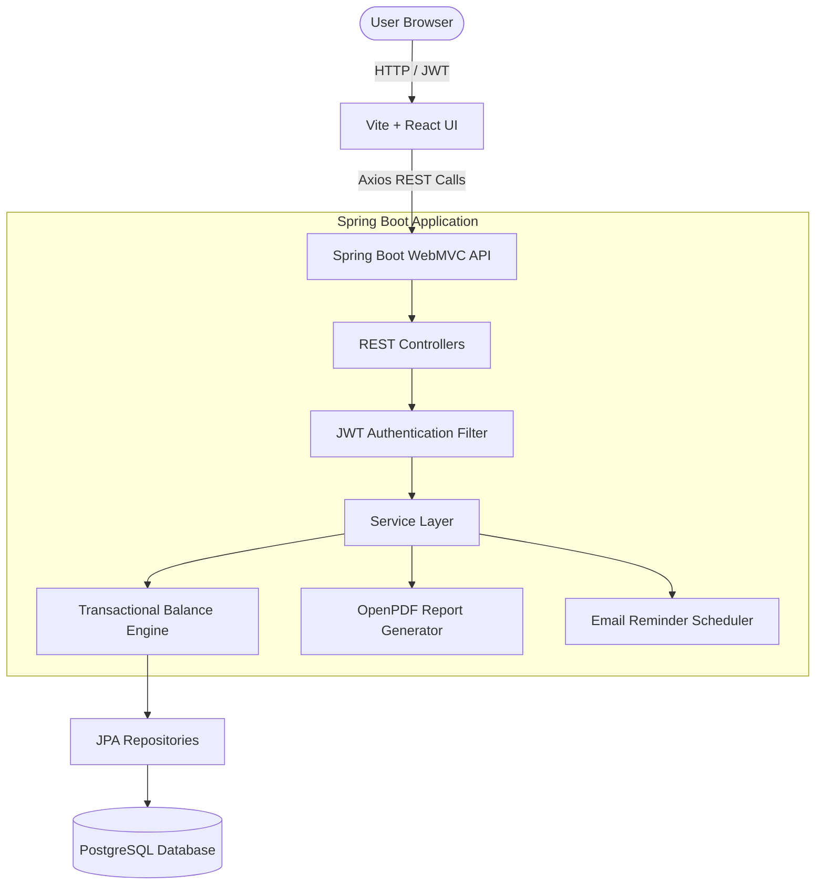

# Smart Ledger - Full-Stack Expense Tracker

Smart Ledger is a beautiful, modern, production-ready Full-Stack Expense Tracker web application designed to help users manage multiple financial accounts, track daily expenses & income, view real-time analytics, configure daily payment reminders, and download professionally styled PDF reports.

---

## 🚀 Key Features

*   **Secure Authentication**: JWT token-based authentication with BCrypt password hashing, secure state synchronization via custom AuthContext, and HTTP requests intercepted for automatic token attachment and 401 token expiration handling.
*   **Multi-Account Scoping**: Create and manage multiple custom accounts (e.g., Cash, SBI Bank, Credit Card). Transactions are strictly scoped per account.
*   **Smart Transaction Engine**: Dynamic balance deduction and addition with transactional safety (`@Transactional`). Handles edits (such as switching accounts, updating amounts, or reversing transactions) automatically and cleanly.
*   **Interactive Analytics Dashboard**: Beautiful glassmorphic summary cards, interactive income vs. expense trends (via Recharts), category breakdown graphs, financial health tips, and recent transaction audit trail.
*   **Automatic Payment Reminders**: Scheduled daily reminders and upcoming bills tracking system. Seamless console-based email logs for local testing, gracefully fallback to SMTP.
*   **Professional PDF Reporting**: Custom styled financial reports with customizable date presets, dynamically built with OpenPDF (tables, alignment, fonts, net savings indicator).
*   **Responsive & Premium UI**: Built with Material UI (MUI), featuring a fully custom dark mode, Outfit and Inter Google Fonts typography, modern glassmorphism, responsive sidebar drawer (drawer switches dynamically between mobile/desktop), hover effects, and loading spinner controls.

---

## 🛠️ Technology Stack

### Backend
*   **Core**: Java 21 & Spring Boot 3.5.14
*   **Security**: Spring Security & JWT (JJWT 0.12.5)
*   **Database**: Spring Data JPA & PostgreSQL (Hibernate auto DDL schema creation)
*   **PDF Generation**: OpenPDF 2.0.0 (fully open-source alternative to iText)
*   **API Specs**: Springdoc OpenAPI Starter WebMVC UI 2.5.0 (Swagger 3)
*   **Mailing**: Spring Boot Starter Mail

### Frontend
*   **Core**: React 19 & Vite 8
*   **Routing**: React Router DOM 7
*   **Design & UI**: Material UI (MUI) 9, Emotion React/Styled, Material Icons
*   **Charts**: Recharts 3
*   **State & HTTP**: Axios (with secure JWT Interceptors), React Context API
*   **Notifications**: React Hot Toast

---

## 🏗️ System Architecture



---

## 📂 Project Structure

```text
Expense-Tracker/
├── backend/
│   ├── src/
│   │   ├── main/
│   │   │   ├── java/com/expensetracker/
│   │   │   │   ├── controller/      # REST API endpoints
│   │   │   │   ├── dto/             # Data Transfer Objects
│   │   │   │   ├── entity/          # JPA Entity definitions
│   │   │   │   ├── exception/       # Global exception handlers
│   │   │   │   ├── repository/      # JPA Data repositories
│   │   │   │   ├── security/        # Spring Security, JWT, custom UserDetails
│   │   │   │   └── service/         # Business logic interfaces & impls
│   │   │   └── resources/
│   │   │       └── application.yml  # Local application & DB properties
│   │   └── test/                    # 23 Unit & Integration Tests (H2 in-memory)
│   ├── Dockerfile                   # Multi-stage JVM runtime container setup
│   └── pom.xml                      # Maven configuration & versions
└── frontend/
    ├── src/
    │   ├── components/              # Sidebar, protected layouts, navbar
    │   ├── context/                 # AuthContext & Theme state
    │   ├── lib/                     # Axios client & JWT interceptor config
    │   ├── pages/                   # Dashboard, Accounts, Expenses, Income, Reminders, Reports, Profile
    │   ├── App.jsx                  # React Router mapping
    │   ├── index.css                # Base layout & font styles
    │   └── theme.js                 # Premium Material UI custom theme configuration
    ├── index.html                   # HTML entry point (Outfit/Inter fonts configured)
    ├── package.json                 # Node modules & Vite scripts
    └── vite.config.js               # React/Vite bundler config
```

---

## ⚙️ Local Development Setup

### Prerequisites
*   **Java JDK 21 or Java 24** installed
*   **Node.js v20+** installed
*   **PostgreSQL 17** installed and running locally

### Database Setup
1.  Open your PostgreSQL shell (`psql`) or pgAdmin and log in with your superuser credentials (`postgres`):
    ```sql
    CREATE DATABASE expensetracker;
    ```

### Backend Setup (`backend/`)
1.  Navigate to the `backend/` directory.
2.  Open `src/main/resources/application.yml` and verify the datasource credentials match your database server details. It is configured out-of-the-box to use:
    ```yaml
    spring:
      datasource:
        url: jdbc:postgresql://localhost:5432/expensetracker?sslmode=disable
        username: postgres
        password: dhoddudb
    ```
3.  Run backend unit & integration tests to verify compile correctness:
    ```bash
    ./mvnw test
    ```
4.  Launch the Spring Boot development server (listens on port `8081`):
    ```bash
    ./mvnw spring-boot:run
    ```

### Swagger API Documentation
Once the backend starts, you can access the Swagger UI directly to browse, test, and run sandbox queries against the REST API:
🔗 **[http://localhost:8081/swagger-ui/index.html](http://localhost:8081/swagger-ui/index.html)**

---

### Frontend Setup (`frontend/`)
1.  Navigate to the `frontend/` directory.
2.  Install dependencies:
    ```bash
    npm install
    ```
3.  Start the Vite React server locally (runs on port `5173`):
    ```bash
    npm run dev
    ```
4.  Open your browser and navigate to: **[http://localhost:5173](http://localhost:5173)**

---

## ☁️ Deployment Instructions

### 1. PostgreSQL Cloud Database Setup (Neon / Supabase)
1.  Create a free PostgreSQL instance on [Neon](https://neon.tech/) or [Supabase](https://supabase.com/).
2.  Copy the connection string (JDBC format).
3.  Make sure your database password is URL-encoded if it contains any special characters.

### 2. Backend Deployment on Render / Railway
1.  Link your GitHub repository to Render or Railway.
2.  Set the environment build settings:
    *   **Runtime**: Docker (Render/Railway will automatically detect the `Dockerfile` inside the `backend` directory)
    *   **Port**: `8081`
3.  Add the following **Environment Variables**:
    *   `DB_URL`: `jdbc:postgresql://<your-cloud-db-host>:<port>/<db_name>`
    *   `DB_USERNAME`: `<your-cloud-db-username>`
    *   `DB_PASSWORD`: `<your-cloud-db-password>`
    *   `JWT_SECRET`: `<a-long-secure-random-base64-encoded-string>`
    *   `JWT_EXPIRATION`: `86400000` (24 Hours in milliseconds)

### 3. Frontend Deployment on Netlify / Vercel
1.  Link your GitHub repository.
2.  Configure your build commands:
    *   **Build Command**: `npm run build`
    *   **Publish Directory**: `dist` (Vite output folder)
    *   **Root Directory**: Set to `frontend`
3.  Add the following **Environment Variables**:
    *   `VITE_API_URL`: `<your-deployed-backend-url>` (e.g., `https://your-backend.onrender.com`)
4.  **SPA routing (required for reload on deep links)**:
    *   **Vercel**: `frontend/vercel.json` rewrites all routes to `index.html` (already included).
    *   **Netlify**: `frontend/public/_redirects` with `/* /index.html 200` (already included).
    Without this, refreshing `/dashboard`, `/expenses`, etc. returns `404 NOT_FOUND`.
